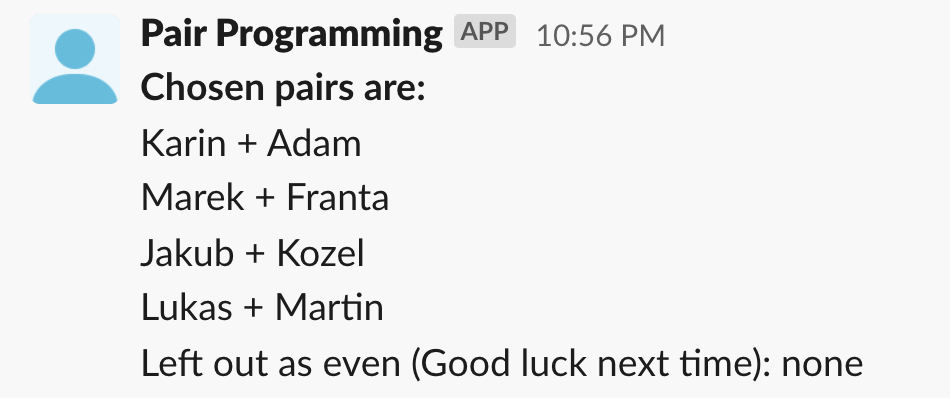

Simple program to generate pairs from a list of people. Useful to set up automatic pair programming sessions.

## Features
- Creates randomized pairs out of the provided list of names (names are shuffled)
- Stores history of used pairs so every run will create new pairs (if all pairs were already created, it starts again)
- If there is an even name, it gets listed separately
- Provides built-in integration to Slack

## How to use
1. Create a task
2. Fill the list of names
3. Optionally, setup the Slack channel and token
4. Schedule the task to run as you need
5. The historical pairs are stored in Key-Value Store called `PEOPLE-PAIRING` with record `My-best-team`
6. You can delete this record to start fresh pairing (but it does it automatically once all pairs were created)
7. If you want to track more teams, create a separate task with different `teamName` so the history is stored separately

Slack message can look like this:

